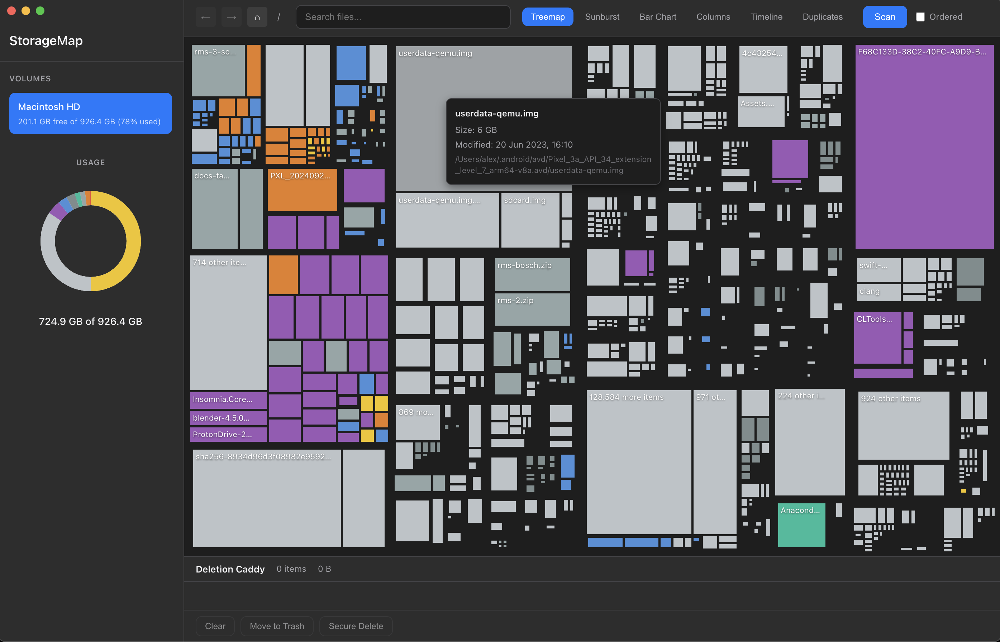
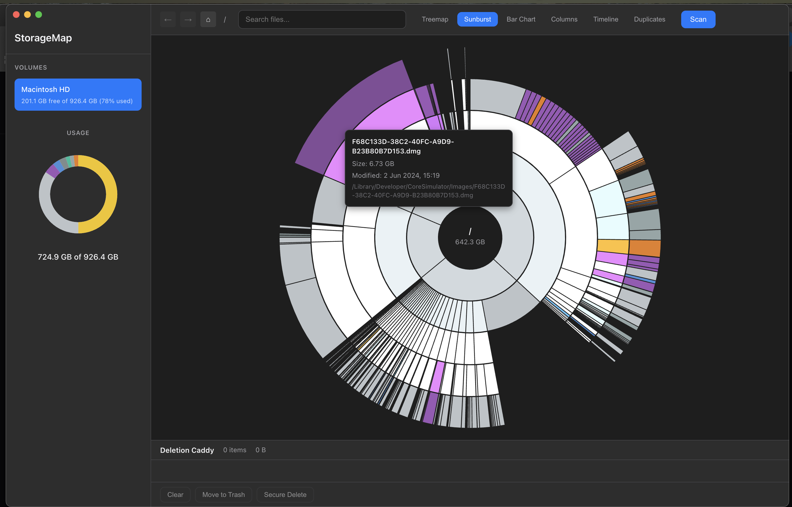
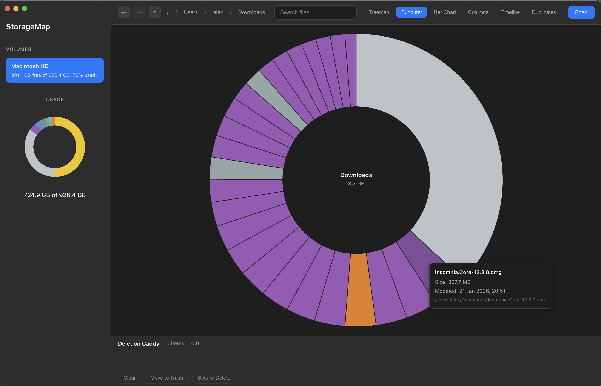
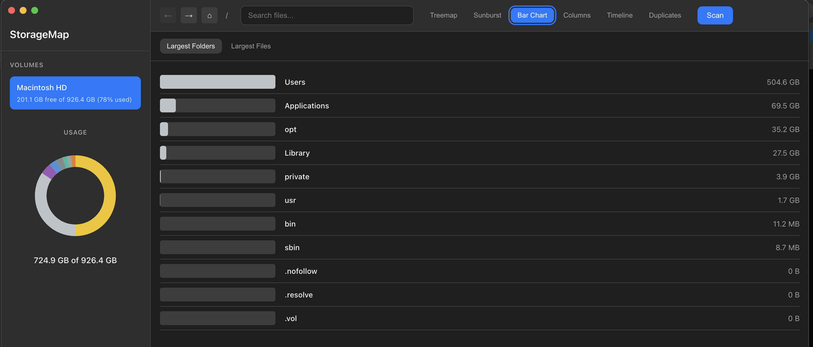
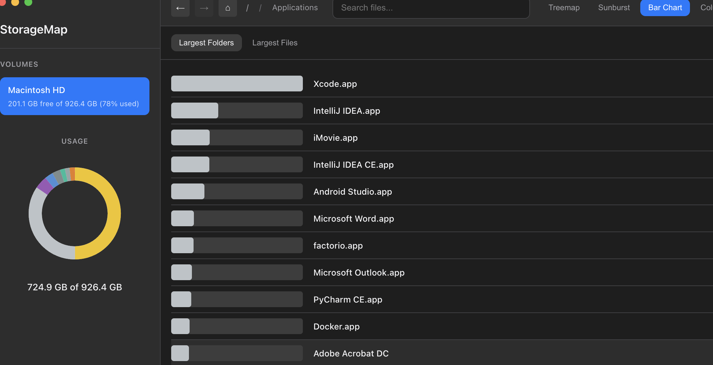
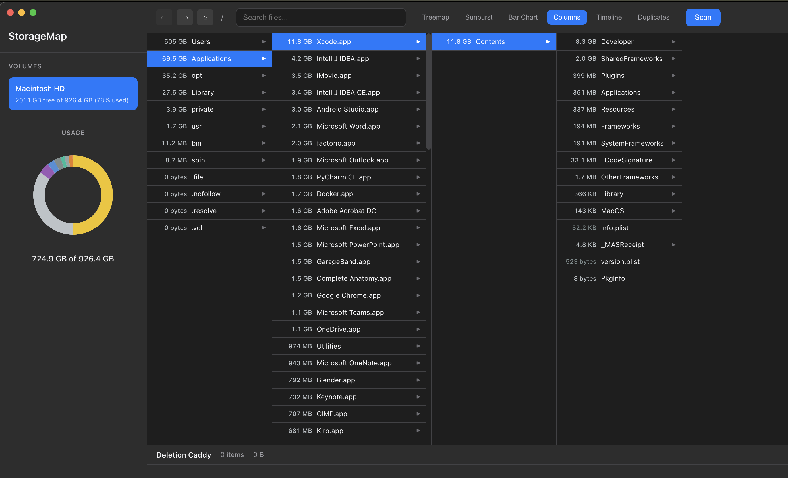
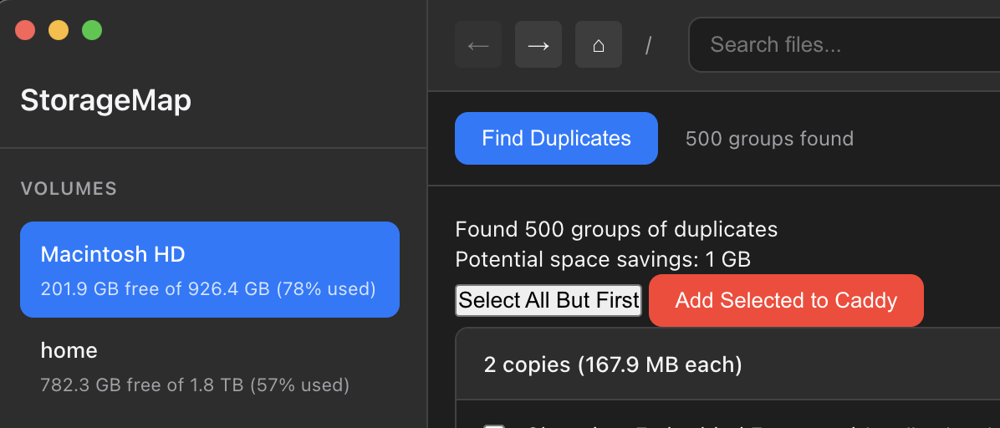
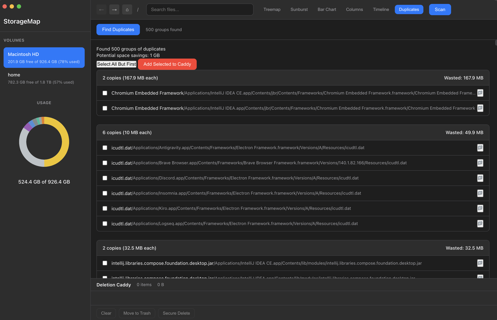
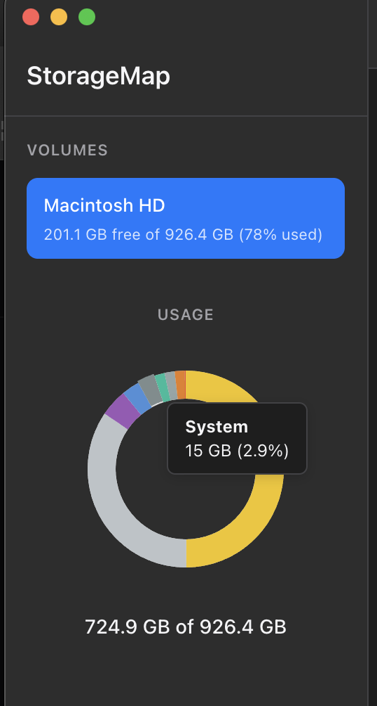

# StorageMap

A macOS storage visualizer that helps you understand and manage your disk space through interactive visualizations.

  


## Features

### Multiple Visualization Modes

- **Treemap** - Squarified treemap showing files and folders as nested rectangles proportional to their size
- **Sunburst** - Radial partition layout showing the directory hierarchy as concentric rings
- **Bar Chart** - Simple bar chart view of largest files and folders
- **Columns** - OmniDiskSweeper-style miller column view for drilling down through directories
- **Timeline** - Track storage usage over time with historical snapshots

### Storage Analysis

- Fast recursive directory scanning with progress indication
- File categorization (Documents, Applications, Media, Developer, Archives, System, etc.)
- Category-based color coding across all visualizations
- Search and filter files with real-time highlighting

### Duplicate Detection

- Find duplicate files using content hashing
- Partial hashing for large files (fast performance)
- Groups duplicates by content with size-based sorting

### File Management

- **Deletion Caddy** - Stage files for batch deletion
- Move to Trash or Secure Delete (zero-pass overwrite)
- Reveal files in Finder
- Right-click context menu support

### Volume Support

- Auto-detect mounted volumes
- Support for external drives and disk images
- Per-volume storage statistics

## Screenshots

### Treemap View
Squarified treemap showing files and folders as nested rectangles, sized proportionally to disk usage.



### Sunburst View
Radial partition layout showing the directory hierarchy as concentric rings.



Drill down into directories by clicking on segments:



### Bar Chart View
Simple bar chart showing largest files and folders with drill-down navigation.





### Columns View
OmniDiskSweeper-style miller column view for drilling down through directories.



### Duplicate Detection
Find and manage duplicate files with content-based hashing.





### Storage Summary
Donut chart showing category breakdown with disk usage statistics.



## Requirements

- macOS 14+ (Sonoma)
- Node.js 18+
- Full Disk Access permission (for complete visibility)

## Installation

```bash
# Clone the repository
git clone https://github.com/yourusername/storagemap.git
cd storagemap

# Install dependencies
npm install

# Build and run
npm start
```

## Development

```bash
# Run in development mode (with hot reload for TypeScript)
npm run dev

# Build only
npm run build

# Package for distribution
npm run dist
```

## Project Structure

```
storagemap/
├── src/
│   ├── main/                    # Electron main process
│   │   ├── scanner/             # Filesystem scanning
│   │   ├── database/            # SQLite for history
│   │   ├── file-ops/            # Delete operations
│   │   ├── duplicate/           # Duplicate detection
│   │   └── ipc/                 # IPC handlers
│   ├── renderer/                # Electron renderer process
│   │   ├── components/          # UI components
│   │   ├── visualizations/      # D3.js visualizations
│   │   ├── state/               # State management
│   │   └── styles/              # CSS styles
│   ├── shared/                  # Shared types and utilities
│   └── preload/                 # Context bridge
├── dist/                        # Compiled output
└── release/                     # Packaged app
```

## Tech Stack

- **Framework**: Electron
- **Visualization**: D3.js
- **Database**: SQLite (better-sqlite3)
- **Language**: TypeScript
- **Bundler**: esbuild

## Usage Tips

1. **Grant Full Disk Access** - Go to System Preferences > Privacy & Security > Full Disk Access and add StorageMap for complete visibility

2. **Navigate visualizations** - Click on folders to drill down, use breadcrumb or back button to navigate up

3. **Delete files** - Right-click files to add them to the deletion caddy, then review and delete in batch

4. **Find duplicates** - Switch to the Duplicates tab and click "Find Duplicates" to scan for duplicate files

5. **Search** - Use the search bar to filter and highlight files matching your query

## License

MIT
